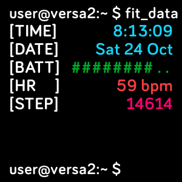

# Console
## A FitBit Versa 2 clock face

I own a FitBit Versa 2 and I like having a geeky clock face. While one already exists, called Terminal, it's riddled with bugs and randomly crashes my FitBit every few weeks. So I decided to write my own. Here is what I came up with and will be submitting to the FitBit Gallery. Feel free to fork and/or request changes and additions. I'll add more details as time allows.
